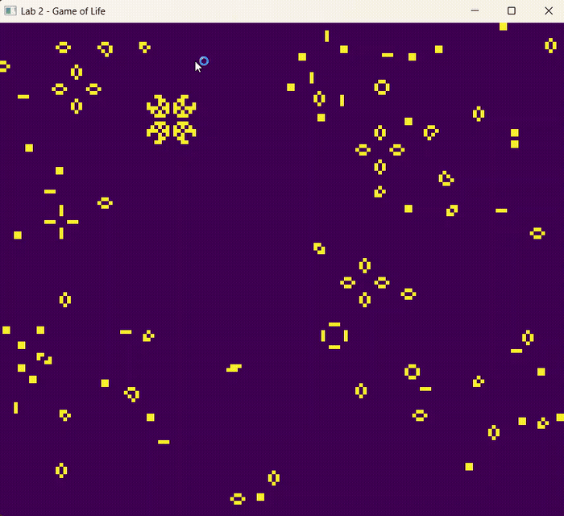

# Lab 2 — Conway's Game of Life

Implementación en Rust de **el Juego de la Vida de Conway**, usando raylib para renderizar el estado del framebuffer en tiempo real dentro de una ventana redimensionable.

## Demo



## Reglas implementadas

Cada "turno" es un frame. Para cada célula:

1. Una célula viva con menos de 2 vecinos vivos, muere (*underpopulation*).
2. Una célula viva con 2 o 3 vecinos vivos, sobrevive.
3. Una célula viva con más de 3 vecinos vivos, muere (*overpopulation*).
4. Una célula muerta con exactamente 3 vecinos vivos, nace (*reproduction*).

## Arquitectura

- El estado del juego (viva/muerta) vive **exclusivamente en el color de cada píxel** del framebuffer — negro para muertas, amarillo para vivas — leído y escrito únicamente a través de las funciones `point` y `get_color`.
- El framebuffer nunca se limpia entre frames; la propia lógica del juego se encarga de recalcular cada píxel en cada generación.
- El framebuffer trabaja a una resolución más baja que la ventana (150×130 celdas) y se escala automáticamente al tamaño de la ventana mediante una textura.
- Los bordes son de tipo *loop* (toroidales): los patrones que salen de un extremo reaparecen del lado opuesto, permitiendo interacciones más interesantes entre organismos (como los planeadores del cañón).

## Patrones iniciales

El mundo arranca con más de 10 organismos clásicos repartidos por toda la pantalla:

| Categoría | Organismos |
|---|---|
| **Still lifes** | Block, Beehive, Loaf, Boat, Tub |
| **Oscillators** | Blinker, Toad, Beacon, Pulsar |
| **Spaceships** | Gliders, Lightweight Spaceship (LWSS) |
| **Gun** | Gosper Glider Gun (x2) |

## Controles

| Tecla | Acción |
|---|---|
| `P` | Guarda un screenshot del framebuffer actual (`screenshot_N.png`) |
| `R` | Reinicia el patrón inicial |
| Cerrar ventana / `ESC` | Termina la ejecución |

## Cómo ejecutar

Requiere [Rust](https://www.rust-lang.org/tools/install), [CMake](https://cmake.org/download/) y [LLVM](https://github.com/llvm/llvm-project/releases) instalados (dependencias nativas de raylib).

```bash
git clone https://github.com/samuelrobledo52/Lab2-Graficas.git
cd Lab2-Graficas
cargo run
```

## Autor

Samuel Antonio Robledo López — Universidad del Valle de Guatemala
